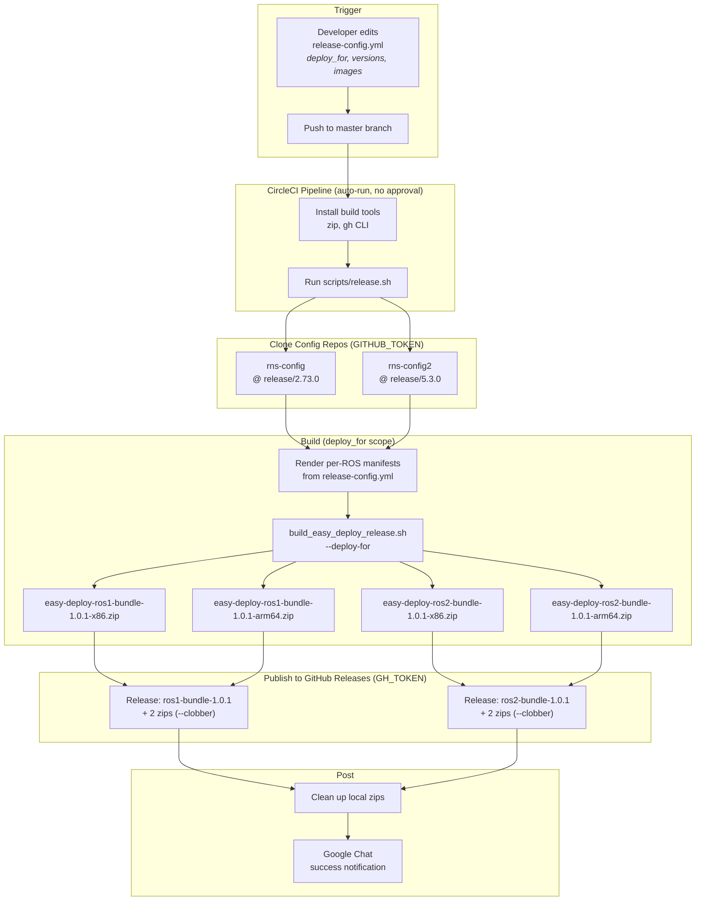
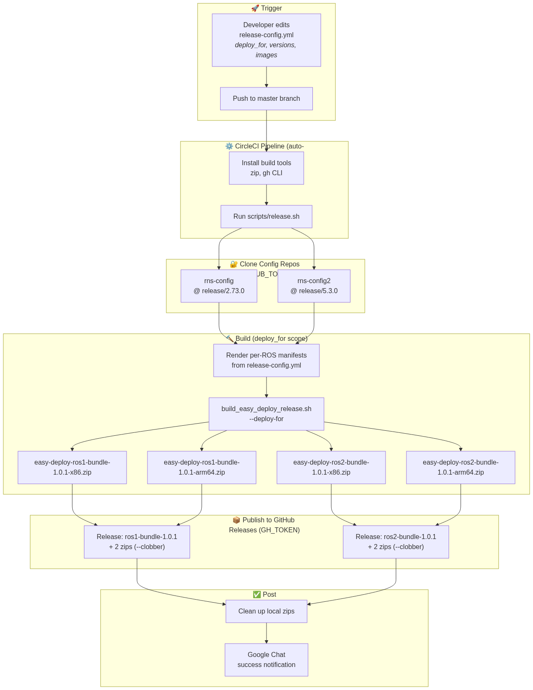

# Easy Deploy Release — CI/CD Workflow

This document explains how a release is produced automatically by CircleCI from
a single source-of-truth file. For the per-field reference, see
[release-config.yml](../release-config.yml); for the internal build guide, see
[README_INTERNAL.md](../README_INTERNAL.md).

## Overview

A release is triggered by **pushing to `master`**. No manual build step and no
approval gate — editing [release-config.yml](../release-config.yml) and pushing
is the entire release action.

The pipeline:

1. Installs build tools (`zip`, the GitHub CLI `gh`).
2. Clones the private config repos (`rns-config`, `rns-config2`) at the refs
   declared in `release-config.yml`.
3. Renders per-ROS manifests and builds the Easy Deploy zips via the proven
   builder, honoring `deploy_for` (build only `ros1`, `ros2`, or `both`).
4. Publishes the zips to **GitHub Releases** under tags `ros1-<bundle-id>` and
   `ros2-<bundle-id>` (overwriting with `--clobber` if a tag already exists).
5. Cleans up the local zips and sends a Google Chat notification.

## Pipeline Diagram

> GitHub renders the diagram below natively. A PNG fallback is also bundled at
> [assets/ci-workflow-diagram.png](assets/ci-workflow-diagram.png).





## Trigger

| What | Detail |
|------|--------|
| **Source of truth** | [`release-config.yml`](../release-config.yml) at the repo root |
| **Event** | Push to the `master` branch |
| **Gate** | None — runs automatically on every qualifying push |

When `release-config.yml` is absent, the orchestrator falls back to the legacy
manual flow using [`manifests/*.yaml`](../manifests) and a pre-existing local
config directory. That path is unchanged.

## Stages

### 1. Install build tools
Installs `zip` (and verifies `git`, `curl`, `jq`) and the GitHub CLI (`gh`)
from the official deb repo (`cimg/base` does not ship `gh`). Fails fast if `gh`
cannot be installed (it's required to publish).

### 2. Clone config repos
`scripts/release.sh` clones the matching config repositories at the ref
configured in `release-config.yml`:

- ROS1: `movelrobotics/rns-config` at `ros1.config` (e.g. `release/2.73.0`)
- ROS2: `movelrobotics/rns-config2` at `ros2.config` (e.g. `release/5.3.0`)

Both are private, so the clone uses `GITHUB_USER` / `GITHUB_TOKEN` from the
CircleCI contexts. The script aborts with a clear message if a ref is wrong or
the token lacks access. The config version is read from each repo's
`seirios_config_release.yml`.

### 3. Build (scoped by `deploy_for`)
The orchestrator renders per-ROS manifests (without `config.path`, so the
builder uses the cloned config dirs) and runs the proven
[`build_easy_deploy_release.sh`](../scripts/build_easy_deploy_release.sh) with
`--deploy-for {ros1,ros2,both}`. Only the in-scope ROS line(s) are read,
validated, and built. Output goes to `dist/`:

- `deploy_for: ros1` → 2 zips (ros1 x86 + arm64)
- `deploy_for: ros2` → 2 zips (ros2 x86 + arm64)
- `deploy_for: both` (default) → 4 zips

Package names follow `easy-deploy-<ros>-<bundle-id>-<arch>.zip`, where `<ros>`
is `ros1`/`ros2`. A valid `dist/manifest.json` listing only the built assets is
also written.

### 4. Publish to GitHub Releases
For each in-scope ROS line, `gh` publishes under tag `<ros>-<bundle-id>`
(e.g. `ros1-bundle-1.0.1`) to `movelrobotics/easy-deploy-release`:

- If the tag **does not exist**, it creates the release with both arch zips.
- If the tag **already exists**, it uploads the zips with `--clobber`
  (overwriting existing assets of the same name).

Auth is via `GH_TOKEN` (set from `GITHUB_TOKEN`). The bundle id is derived from
`release-config.yml`'s `version` field as `bundle-<version>`.

> **Note:** because `--clobber` overwrites published assets, treat published
> tags as immutable in practice. To re-cut a release, bump `version` in
> `release-config.yml` rather than re-pushing the same value.

### 5. Post (cleanup + notify)
- **On success:** the local `dist/*.zip` files are removed (they now live on
  GitHub Releases; each is ~115 MB), and a Google Chat success card/message is
  sent.
- **On failure:** the Google Chat `notify` command fires a failure card on the
  `build_and_release` job; the `notify-pipeline-success` job does not run.

## Configuration reference

`release-config.yml` schema (see the file for the full live example):

```yaml
deploy_for: both          # ros1 | ros2 | both
author: Movel Robotics

ros1:
  config: release/2.73.0   # branch or tag in movelrobotics/rns-config
  version: 1.0.1           # raw version; bundle id becomes bundle-1.0.1
  x86:  { rns, backend, frontend, backend_worker, redis, rabbitmq, mongo }  # each must include a tag
  arm64: { ...same keys... }

ros2:
  config: release/5.3.0   # branch or tag in movelrobotics/rns-config2
  version: 1.0.1
  x86:  { ... }
  arm64: { ... }
```

| Field | Meaning |
|-------|---------|
| `deploy_for` | Which ROS line(s) to build and publish: `ros1`, `ros2`, or `both`. |
| `author` | Release author written into each package's `release_info.json`. |
| `<ros>.config` | Branch or tag to clone from the matching config repo. |
| `<ros>.version` | Raw version; the bundle id is `bundle-<version>`. |
| `<ros>.(x86\|arm64).*` | Docker image refs, each MUST include a tag. |

## Required secrets (CircleCI contexts)

These are provided by the `movelai-global` / `movelai-ros` contexts (the same
ones used by the `rns-ros` / `rns-ros2` pipelines):

| Secret | Used for |
|--------|----------|
| `GITHUB_USER` / `GITHUB_TOKEN` | Cloning the private config repos. |
| `GITHUB_TOKEN` (as `GH_TOKEN`) | Authenticating `gh release create/upload`. |
| `CIRCLE_TOKEN` | The Google Chat `notify` command calls the CircleCI API. |
| `GOOGLE_CHAT_WEBHOOK` | Pipeline status cards (running/success/failure). |
| `GOOGLE_CHAT_MSG_WEBHOOK` | Free-text status messages. |

No new secrets are required for this pipeline.

## Local dry-run

You can reproduce a CI build locally without publishing. With a local
`GITHUB_USER` / `GITHUB_TOKEN`:

```bash
bash scripts/release.sh --no-upload --dist-dir dist
```

Without a token, seed the config dirs from existing local checkouts and skip the
clone with `--keep-config`:

```bash
mkdir -p .release/configs
cp -a /path/to/rns-config     .release/configs/rns-config
cp -a /path/to/rns-config2    .release/configs/rns-config2
bash scripts/release.sh --no-upload --keep-config --dist-dir dist
```

`--no-upload` guarantees nothing is published. Inspect `dist/manifest.json` and
one package's `release_info.json` before trusting a build.

## Key files

| File | Role |
|------|------|
| [`release-config.yml`](../release-config.yml) | Single source of truth (overrides `manifests/*.yaml`). |
| [`scripts/release.sh`](../scripts/release.sh) | Orchestrator: parse → clone → render → build → publish. |
| [`scripts/build_easy_deploy_release.sh`](../scripts/build_easy_deploy_release.sh) | Proven builder; supports `--deploy-for {ros1,ros2,both}`. |
| [`../.circleci/config.yml`](../.circleci/config.yml) | Master-only CircleCI workflow. |
| [`manifests/ros1-release.yaml`](../manifests/ros1-release.yaml) | Legacy fallback manifest (ROS1). |
| [`manifests/ros2-release.yaml`](../manifests/ros2-release.yaml) | Legacy fallback manifest (ROS2). |
